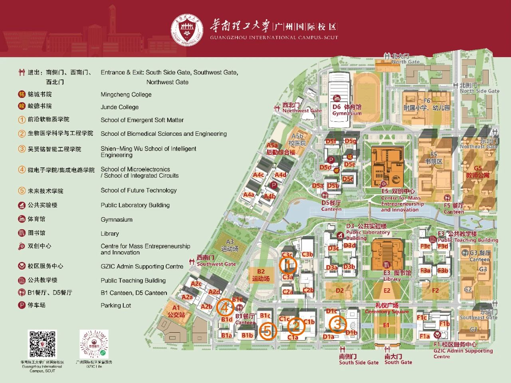

# 交通

## 校区地图

<figure><figcaption>
（来源华工国际官方微信号“华南理工广州国际校区”）
</figcaption></figure>

国际校区的布局是南北朝向，从西向东分别以 A 到 G 排序，从南到北以 1 到 6 排序，例如国际校区的图书馆，就位于 E3 的位置。

另附五山校区和大学城校区的地图：

也可以去华南理工大学官网查看在线地图：



## 出行方式

推荐的交通方式和路线

### &#x20;通勤校巴

