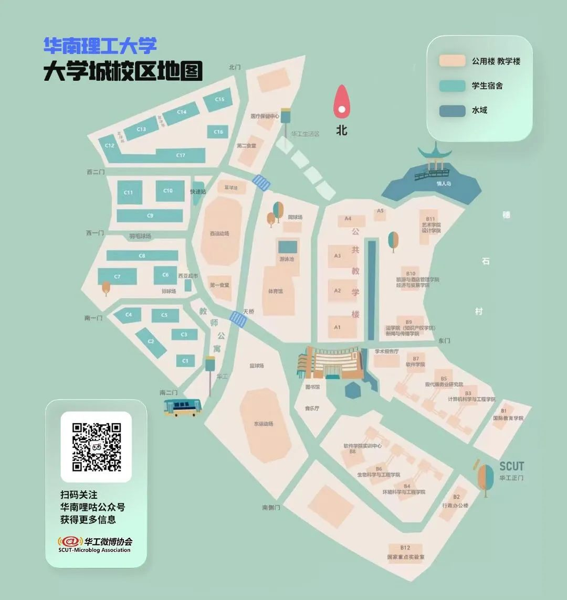
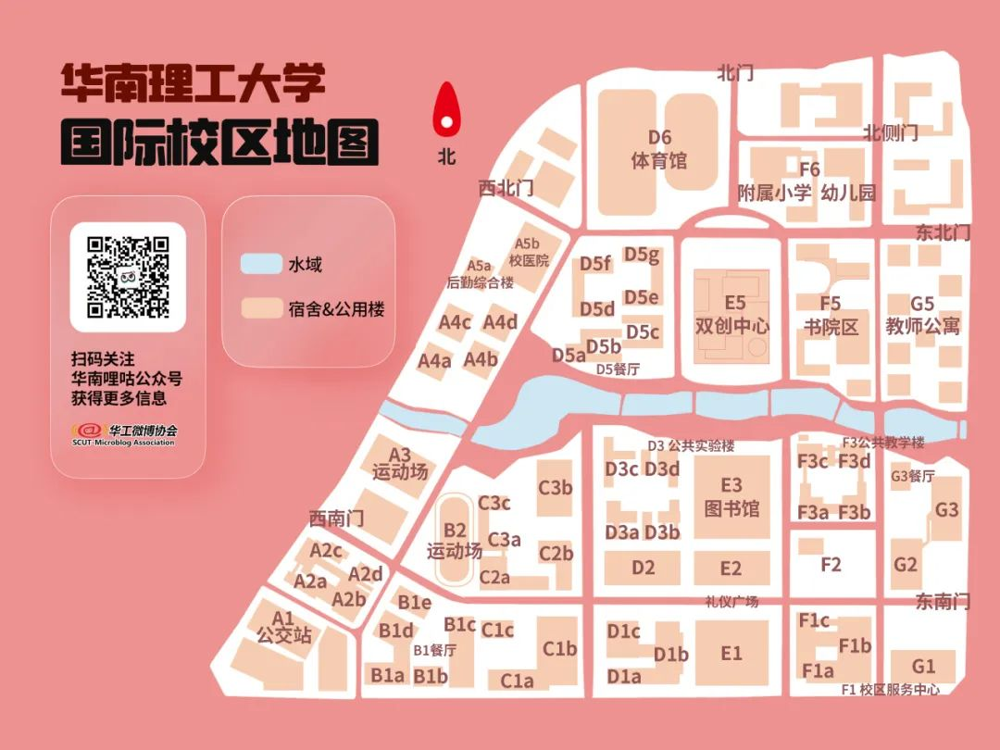
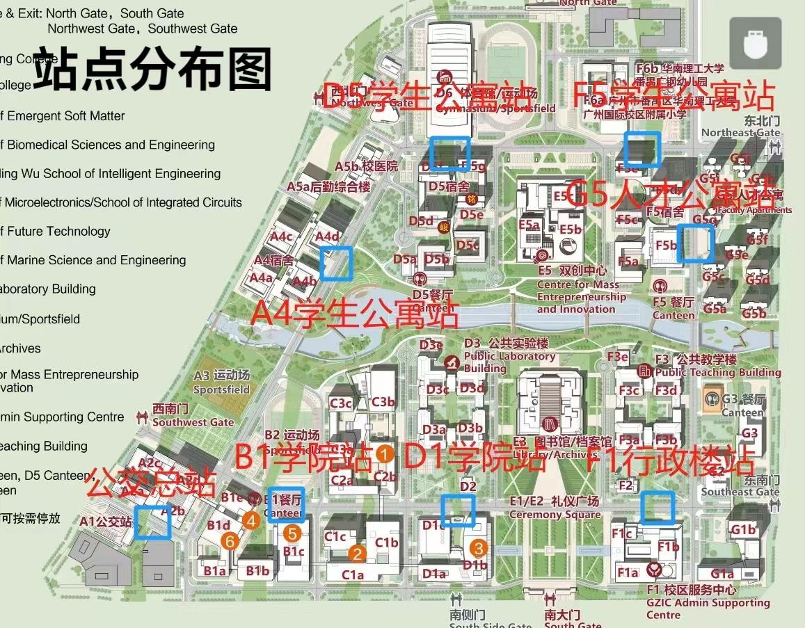
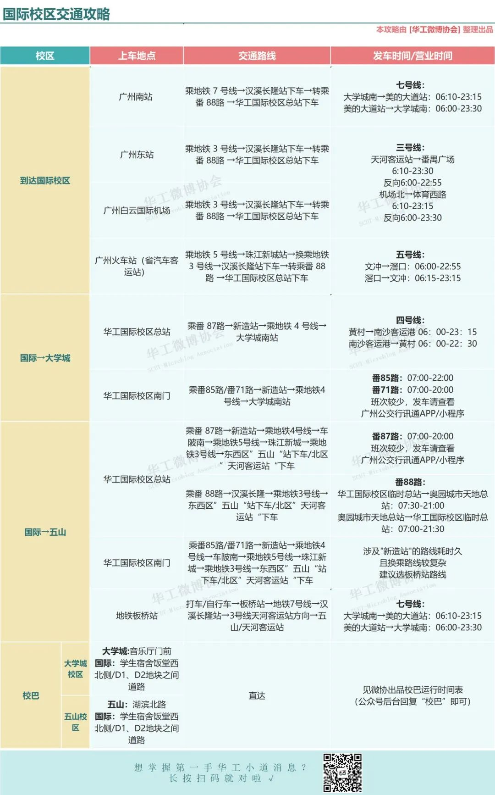

# 交通篇

## 校园地图

可在 [华南理工大学地理信息系统](https://map.scut.edu.cn/login\_home.html) 查看三个校区的地图。

<figure><figcaption>
（来自于微信公众号“华南理工广州国际校区”）
</figcaption></figure>

暂未搜集到五山校区和大学城校区的官方地图，欢迎补充。

由“华南鲤咕”出品的三校区地图：

<figure><figcaption>
<a href="https://mp.weixin.qq.com/s/Bx1Fh2nxNdLtndOYsIDapQ">微协攻略 | 五山宿舍生存指南</a>
</figcaption></figure>

<figure><figcaption>
<a href="https://mp.weixin.qq.com/s/Q718QNhpQBvdCAAldtdJgw">微协攻略 | 南校住行攻略</a>
</figcaption></figure>

<figure><figcaption>
<a href="https://mp.weixin.qq.com/s/g2eSDW9EuDHxiJlmqThcSg">微协攻略 | 国际校区攻略Ⅰ（学习生活篇）</a>
</figcaption></figure>

国际校区南北朝向，从西向东分别以 A 到 G 排序，从南到北以 1 到 6 排序，例如图书馆，就位于 E3 的位置。

## 出行方式

### 五山校区

**地铁** - 3号线五山站，近五山校区东门;

**地铁** - 3号线、6号线天河客运站站，近五山校区北区东门;

**公交** - 华工大总站，近五山校区南门，公交线路有32路、230路、775路、大学城专线2路;

**公交** - 华工大站，近五山校区东门、南门，公交线路有20路、41路、78A路、78路、197路、218路、405路、B10路、高峰快线32路、夜23路、夜53路。

### 大学城校区

**地铁** - 4号线、7号线大学城南站，近大学城校区生活区;

**公交** - 华工站，公交线路有大学城专线1路、大学城专线2路、大学城专线3路、大学城环线1路、大学城环线2路、86路、332路、387路、番201路、番202路、夜50路。

### 国际校区

**地铁** - 4号线新造站，出站后转乘番87路至华工国际校区公交总站；

**公交** - 华工国际校区公交总站，近广州国际校区西南门，公交线路有番10路、番17路、番87路、番88路、番186路；

**公交** - 华工国际校区南门站，近广州国际校区南门，公交线路有番51B路、番71路、番85路长线、番87路。

以上三校区交通方式介绍来源于：[出家门，进校门，2023级新同学，报到指南给你全程指引！](https://mp.weixin.qq.com/s/zqO13kD-TKB6EOYyAKA4Uw)

其中国际校区出行不便，以下是一些小的建议：

1. 地铁：西北门打网约车/骑共享单车至板桥/新造地铁站出行。
2. 通过通勤校巴前往另外两个校区再出行。例如要去天河区可以先搭乘校巴到五山校区，省时省心省力省钱。
3.  公交：可参照上述方案，另外国际校区于2023年开通了校园巴士[（校区通知）](https://www2.scut.edu.cn/gzic/2023/0831/c30280a517336/page.htm)，新造-公交总站双向发车，公交总站—新造地铁站线路服务时间为7:30-20:30，每逢半点发车；新造地铁站—公交总站线路服务时间为8:00-21:00，每逢整点发车。站点图如下：&#x20;

    <figure><figcaption></figcaption></figure>

校区内与校区间往返校巴运行时间表的准确时间请关注学校官网。

也可以关注由各学生组织制作的信息汇总表。例如以下资料来源于“华南鲤咕“微信公众号。

<figure><figcaption>
<a href="https://mp.weixin.qq.com/s/g2eSDW9EuDHxiJlmqThcSg">微协攻略 | 国际校区攻略Ⅰ（学习生活篇）</a>
</figcaption></figure>

<figure><figcaption>
“华南鲤咕“微信公众号后台回复”校巴“获得
</figcaption></figure>
